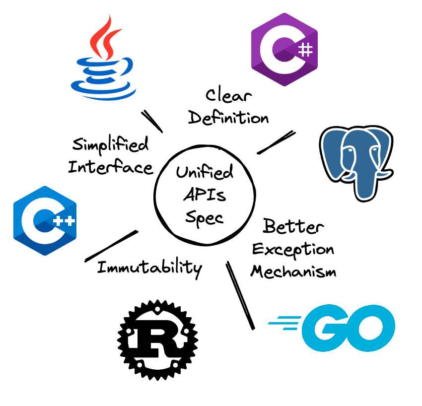

# Design

This project aims to build lightweight, cloud-native clients, and establish the unified messaging model/APIs design acorss languages.

## Messaging Model

We assume that you are familiar with the basic concepts and terminologies about Apache RocketMQ. Therefore, we will not go into details about that.

### Message/Topic Types

In order to adapt different scenarios, we defined different types for messages to publish.

* **FIFO**(First In, First Out): follows standard [FIFO](https://en.wikipedia.org/wiki/FIFO) semantics, this type of message must set the `message group`. This type of message need to be used with FIFO consumer group, which guarantees that the message must be received first if the it is published first with the same message group.
* **DELAY**: the message about to be sent is not immediately visible to the consumer, this type of message must set the `delivery timestamp`, which decides the visible time to consumers;
* **TRANSACTIONAL**: wrap the publishing of one or more messages into a transaction, provide commit/rollback method to decide the visibility of messages;
* **NORMAL**: default type. The message type is NORMAL if it does not belong to the other types above.

The different types are mutually exclusive, when means that the message to publish could not be both FIFO type and DELAY type at the same time. Actually the type of the topic determines the type of the message. For example, FIFO topic do not allow the publishing of other types of messages.

### Consumer Group

As we all know, consumer group is the basic unit of load balancing for consumers. Messages are evenly distributed to all consumers in the same consumer group. Now, we assigned more attributes to consumer group rather than the consumer itself.

* Consume timeout: maximum time window between receiving messages and returning an response of acknowledgement. Message will be visible again if time runs out.
* FIFO consumption switch: enable/disable FIFO consumption for FIFO messages.
* Message consumption retry policy: decide the max delivery times and backoff algorithm for the message which is failed to be consumed in push consumer.

Especially, this table shows the sequence of message receiption with the combination of FIFO/non-FIFO topics and FIFO/non-FIFO consumer groups.

|                | FIFO Consumer Group | non-FIFO Consumer Group |
| :------------: | :-----------------: | :---------------------: |
|   FIFO Topic   |        FIFO         |        non-FIFO         |
| non-FIFO Topic |      non-FIFO       |        non-FIFO         |

### Client Categories

There are four types of client.

* Producer: the client to publish message.
* Push consumer: full-managed consumer. Message listener are provided for consumption.
* Simple consumer: the simplest consumer, providing methods to receive messages and change invisible time for messages.
* Pull consumer: for streaming, it allows to get route info manually and select message queues to bind for pulling message.

### Message Identifier

Message identifer provides identity information for each message stored in broker, which means producer can not get the message identifier until it is sent out successfully.

>**Note**: Internal retries during message publishing may cause message duplication, the duplicate messages here have the same message indentifier.

The message identifer layout is redesigned, see more details [here](./message_id.md).

## New and Unified APIs

### Original

[RIP-37: New and Unified APIs](https://shimo.im/docs/m5kv92OeRRU8olqX): RocketMQ proposal of new and unified APIs across different languages.

### Background & Rationale

In fact, current rocketmq APIs exist some problems:

* Lack of well-designed messaging models, which is the prerequisite for unified APIs specification. What’s more, the model strongly affects the definition about behavior. Ambiguous definition makes it harder to predict the behavior of the client.
* Implementation-oriented. It is not friendly to developers. Many features are based on implementation rather than interface. In addition, users are exposed to redundant and complex interfaces with too many details, increasing probability of making mistakes.
* Without an unified APIs lifecycle management system, deprecated APIs are reserved for a long time, making APIs difficult to be upgraded.
