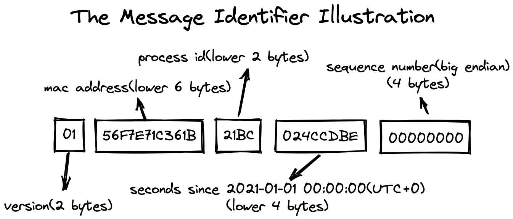

# Message Identifier

Here is the new design for message identifier.

## Background

In the past, there are two types of implementation of message identifier.

1. Message identifier based on the broker address and the offset in message queue, see [MessageDecoder#createMessageId](https://github.com/apache/rocketmq/blob/release-4.9.3/common/src/main/java/org/apache/rocketmq/common/message/MessageDecoder.java#L62-L71).
2. Message identifier based on the client IP and unix timestamp, see [MessageClientIDSetter#createUniqID](https://github.com/apache/rocketmq/blob/release-4.9.3/common/src/main/java/org/apache/rocketmq/common/message/MessageClientIDSetter.java#L114-L131).

The first type of message identifier is purely based on server-side information, which makes each message stored on the broker absolutely unique. The second message identifier is purely based on client information.

Both the two types of message identifier have their own shortcomings in the new context.

For the first type, the new message identifier is not expected to be bound to the persistent information. Considering this scenario: a failure to send message triggers automatic retry, resulting in duplicate message. Since the two messages are exactly the same for client, they should have the same message identifier.

As for the second type, there are some major flaws in the algorithm design. Firstly, some language-specific methods are used to participate in the generation of message identifier. On the other side, when the client runs for more than a month, the probability of message id repetition will be greatly increased.

## Detailed Design

This illustration shows an example of message identifier. The version number of the newly designed version is 0x01, and number of all previous versions is 0x00. The message identifier's length is 17 bytes if its version is higher than 0x00, then we convert it to uppercase hexadecimal to get the message identifier in string format.

>**Note**: Big endian byte order is used to place data in message identifier.

Take the message identifier in the figure as an example, it could be divided into 5 parts:

* **0x01**: fixed 1 byte for current version.
* **0x56F7E71C361B**: lower 6 bytes of local mac address.
* **0x21BC**: lower 2 bytes of process id.
* **0x024CCDBE**: seconds since 2021-01-01 00:00:00(UTC+0, lower 4 bytes).
* **0x00000000**: sequence number(4 bytes).
