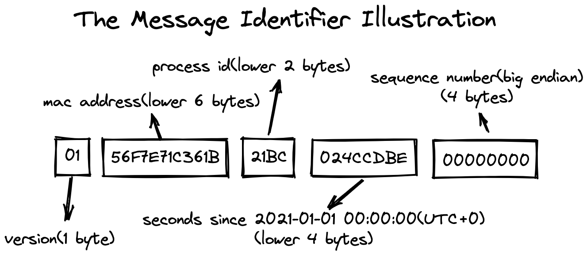

# Message Identifier

Here is the new design for message identifier.

## Background
In the past, there are two types of implementation of message identifier.

1. Message identifier based on the broker address and the offset in message queue, find in [MessageDecoder#createMessageId](https://github.com/apache/rocketmq/blob/release-4.9.3/common/src/main/java/org/apache/rocketmq/common/message/MessageDecoder.java#L62-L71)
2. Message identifier based on the client IP and unix timestamp, find in [MessageClientIDSetter#createUniqID](https://github.com/apache/rocketmq/blob/release-4.9.3/common/src/main/java/org/apache/rocketmq/common/message/MessageClientIDSetter.java#L114-131)

The first type of message identifier is purely based on server-side information, which makes each message stored on the broker absolutely unique. The second message identifier is purely based on client information.

Both the two types of message identifier have their own shortcomings in the new context.

For the first type, the new message identifier is not expected to be bound to the persistent information. Considering this scenario: a failure to send message triggers automatic retry, resulting in duplicate message. Since the two messages are exactly the same for client, they should have the same message identifier.

As for the second type, the imperfect algorithm design is the greatest flaw. Specifically, when the client runs for more than a month, the probability of message id repetition will be greatly increased.

## Detailed Design

