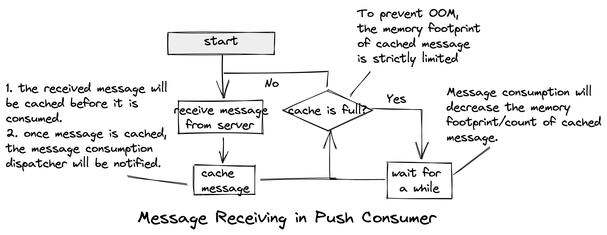

# Workflow

This document elaborates the unified workflow of client. The specific implementations maybe differ from language to language, but they follow the same workflow.

## Startup

Different from previous clients, the new version adds some preparations during the startup. One benefit of this change is to catch more obvious errors or exceptions earlier. These perparations include:

1. Try to fetch route data of topics.
2. Try to get settings from the server, which could do hot-update about these settings. we call this process **server-client telemetry**.

Failure of any preparation will result in the failure of client startup.

In details, the **server-client telemetry** provides a channel to upload the local settings and to overwrite the client settings.

## Periodic Task

The client performs same tasks periodically.

* Update topic route data and cache it. The subsequent request could get route from cache directly.
* Send heartbeat to keep alive.
* Send **server-client telemetry** request. Client settings may be overwritten by telemetry response.

## Message Flow in Producer

The workflow to publish a single message of NORMAL type. The message publishing of other types and publishing of batch messages is similar to it. Some special cases will be explained later.

The publishing process is as follows:

1. Check if topic route is cached before or not.
2. If topic route is not cached, then try to fetch it from server, otherwise go to step 4.
3. Return failure and end the current process if topic route is failed to fetch, otherwise cache the topic route and go to the next step.
4. Select writable candicate message queues from topic route to publish meessage.
5. Return failure and end the current process if the type of message queue is not matched with message type.
6. Attempt to publish message.
7. Return success and end the current process if message is published successfully.
8. Catch the error information of failed message publishing.
9. Return failure and end the current process if the attempt times is run out, otherwirse deecide to retry or not according to the error type.
10. Return failure and end the current process if there is no need to retry, otherwise go to the next step.
11. Isolate the current endpoint for publishing.
12. Rotate to next message queue to publish message, and go to step 6.

> **Note**: The failure of message publishing will isolate the endpoint, this makes the endpoint will not be selected for load balancing as much as possible. The periodic heartbeat to the isolate endpoint will check health status about it and remove it from the isolate endpoints if no more exception is deteched.

For TRANSACTIONAL messages, the publishing will not be retried if failure is encountered. The ordering of FIFO message is based on the assumption that messages which have the same `message group` will be put into the same message queue, thus the message queue to publish is not disturbed by the isolated enpoint([SipHash](https://en.wikipedia.org/wiki/SipHash) algorithm is used to calculate the message queue index for FIFO message publishing).

## Message Flow in Push Consumer

### Message Receiving in Push Consumer

### Message Consumption in Push Consumer(Non-FIFO)

### Message Consumption in Push Consumer(FIFO)

## Message Flow in Simple Consumer

